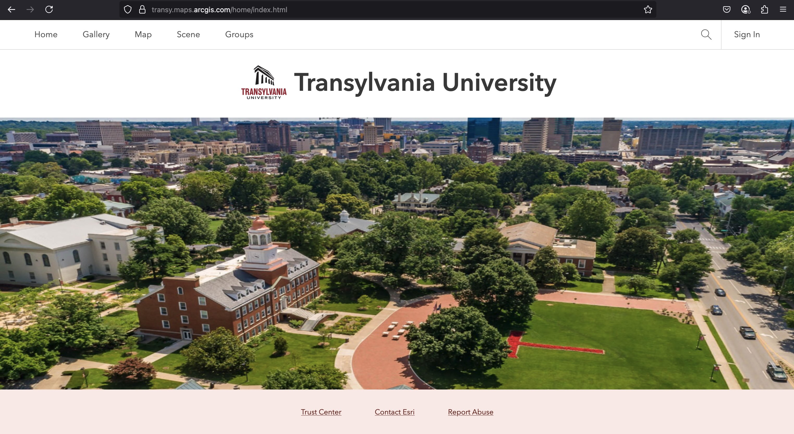

# ArcGIS Online Workshop

  
_Transylvania University's ArcGIS Portal_

## Details

- Date: 3–5 PM, May 9, 2025
- Location: DArt Lab
- Instructor: [Boyd Shearer](https://geography.as.uky.edu/users/blshea1)
- ArcGIS Portal login: [transy.maps.arcgis.com](https://transy.maps.arcgis.com/home/index.html)
- Presentation: [workshop slides](https://boydx.github.io/intro-agol/presentation/)

## Agenda

- Add your data to ArcGIS Online. Please bring a spatial dataset to the workshop. It can be a Shapefile, a KML, a CSV file with latitude and longitude coordinates, or a GeoJSON file. If you don't have any data, we'll have plenty of data provided during the workshop.
- Style your data, add a basemap, and deploy a web map.
- Explore open data portals and pull in data from other sources.
- Create an app to harvest data from the field.
- Build a scene and deploy a story map.

## Overview

This workshop is designed to introduce you to the basics of ArcGIS Online and help you get comfortable with its capabilities. ArcGIS Online is a cloud-based mapping and analysis environment that allows users to manage geographic information. ArcGIS Online is part of the Esri ArcGIS platform, a comprehensive suite of geographic information system (GIS) applications and data.

ArcGIS Online is accessible from a web browser. The main desktop component of the ArcGIS platform is ArcGIS Pro, a Windows OS application used for mapping and analysis. In a typical workflow, users do the heavy lifting in ArcGIS Pro, and then publish their work to ArcGIS Online for collaboration. ArcGIS Online complements ArcGIS Pro by extending geospatial assets to the web.

However, users need not have ArcGIS Pro to use ArcGIS Online. The platform offers a vast ecosystem of data that can be pulled into your portal – one of the topics of this workshops. Before we explore adding and visualizing data, we need to understand a few basic concepts about data types and the ArcGIS Online environment.

## ArcGIS data types for web mapping

Maps are composed of layers of data, and their stacking order determines how they are displayed. Let's imagine the top layer shows a road network. The next layer down shows streams and waterways, and the bottom layer may be an aerial photograph or terrain shaded relief. In ArcGIS Online, we can add layers to our map in the same way.

We have two distinct types of layers: **operational** layers and **basemap** layers. Operational layers are the data layers that you add to your map and customize their symbology. We can add interactivity like popups and derive other types of analysis from operational layers. Basemaps are the non-interactive background layers that provide context for your operational layers.

The most common type of operational layer is a **feature layer**. Feature layers are composed of discrete features, which are the individual points, lines, or polygons representing real-world objects. Each feature can have tabular attributes that describe it. Feature layers can be created from a variety of data sources and files, including Shapefiles and CSV files.

Basemaps were originally tiled raster images (aka, JPEGs, PNGs, or even GIFs), rendered at different zoom levels. This is still the case for many basemaps, but the trend during the past few years is to use vector tiles. Vector tiles are a more efficient way to render maps in the browser (because it sends elemental points, lines, and polygons to the browser) and support dynamic styling at runtime – a game changer in web mapping. ArcGIS Online offers a Vector Tile Style Editor that allows you create customized base maps.

ArcGIS Online has over a dozen layer types that can contribute to your map. In practice, you'll most often use an assortment of layers for a basemap, and use one or two feature layers for your operational layers. The art of mapping is in the selection of layers, how they are styled, and how they fuse together to tell a story.

When we say "map", we mean a collection of layers that are rendered together. In ArcGIS lingo, a map is a 2D representation of layers. A 3D representation of layers is called a "scene." We will make both in this workshop. Another word that you will see often is "app." Web apps facilitate the interaction between the user and the map or scene. Apps can be simple, like an instant web map, or more complex, like a form that allows users to submit data while working in the field.

OK, I think we're ready to start adding data to our map. Let's [start the workshop](https://boydx.github.io/intro-agol/presentation/)!

## Resources

- [ArcGIS Online Documentation](https://www.esri.com/en-us/arcgis/products/arcgis-online/resources-new) provides a gateway to ArcGIS Online tutorials and help documentation.
- [ERSI's MOOCs](https://www.esri.com/training/mooc/) offer free online courses on a variety of topics. Many of the courses use ArcGIS Online.
- [Esri Academy](https://www.esri.com/training/) is the authoritative source for ArcGIS training, some free and some paid. Participants will likely need access to ArcGIS Pro to complete most of the courses.
- [Gentle Introduction to GIS](https://docs.qgis.org/3.40/en/docs/gentle_gis_introduction/index.html) is provided by QGIS, a free and open-source GIS software. QGIS installs on Windows, Mac, and Linux and has been referred to as the "Swiss Army Knife" of geospatial applications. Even if you plan to work entirely in ArcGIS, QGIS is a good tool to have in your toolbox.
- [Cartography Guide](https://www.axismaps.com/guide) by Axis Maps is good reference for printed cartographic design circa 2020. Note: interactive "slippy" maps give our visual surfaces tremendous data density often at the expense of good design. The guide reminds to pay attention to the design of our maps.
- [[UCGIS] GIS&T Body of Knowledge](https://gistbok-topics.ucgis.org/UCGIS) is a well-attributed resource for GIS education and training.
